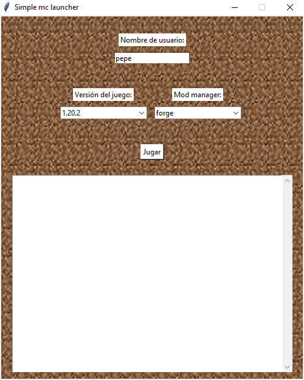

# 🎮 Lanzador Simple para Minecraft

**Lanzador Simple y Sencillo para Minecraft**  
Con este programa podrás iniciar Minecraft de forma rápida y sin complicaciones.

---

## ✨ Características
- Instalación y uso extremadamente simples.
- Solo descarga el archivo y ejecútalo con **doble clic**.
- Compatible con versiones estándar de Minecraft.
- No requiere configuración avanzada.

---

## 📥 Descarga
Puedes obtener la última versión desde la sección de **Releases**:  
➡️ [Descargar última release](../../releases/latest)

---

## 🚀 Cómo usarlo
1. **Descarga** el archivo desde la sección de releases.
2. **Haz doble clic** en el archivo descargado.
3. ¡Disfruta Minecraft sin configuraciones adicionales!

---
